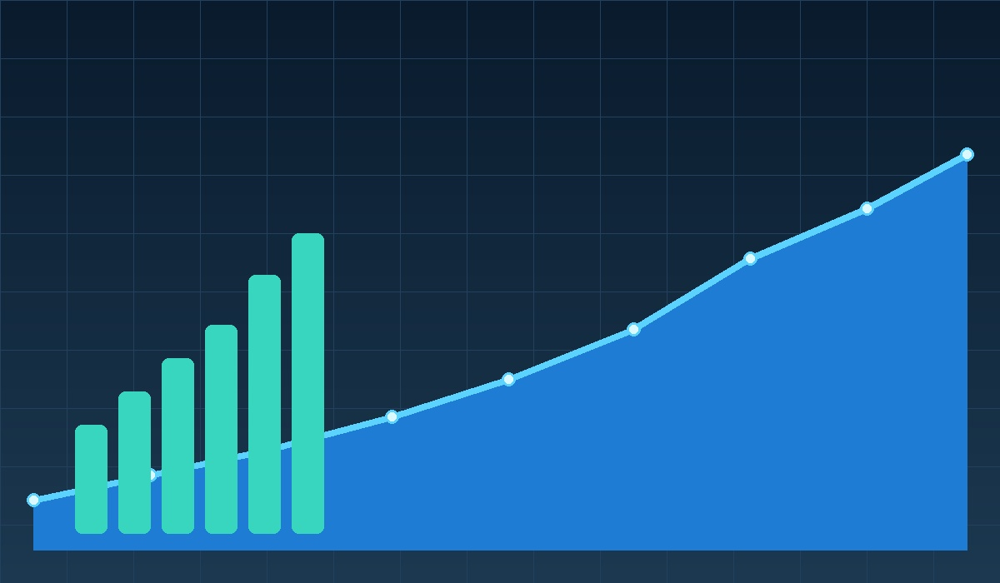
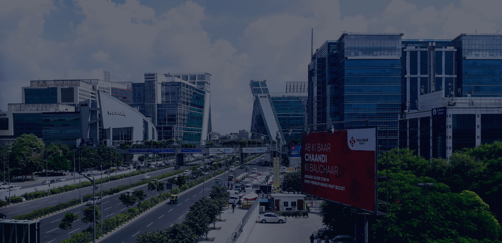
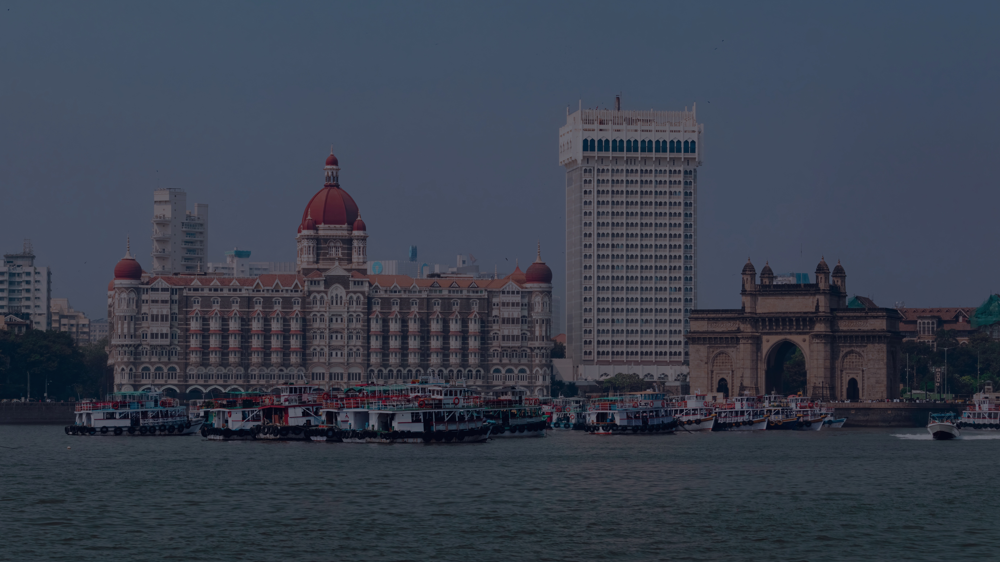
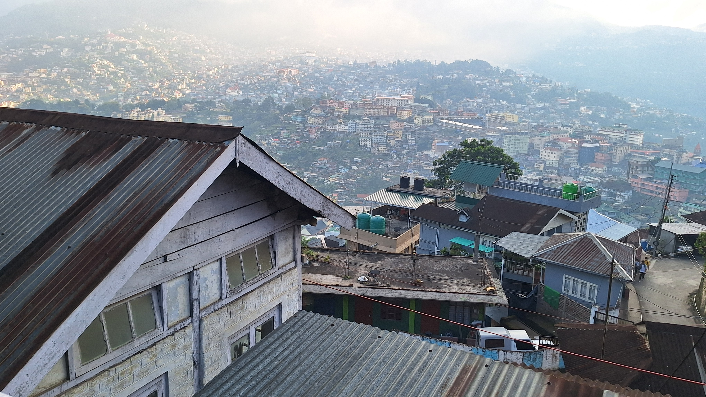

# 🌍 Air-Pulse

Air-Pulse is a **Streamlit-based Air Quality Intelligence platform** focused on **Indian cities**.  
It combines **city-level pollutant data, AQI prediction models, and health-risk guidance** to help users understand air quality conditions and make **safer day-to-day decisions**.

---

## 🌫️ Project Banner


---

## 🏠 Home Experience


---

# 👀 Visual Preview

| Home & Trends | Prediction Theme | City Dashboard |
|---------------|-----------------|---------------|
|  |  |  |

---

# ✨ Key Highlights

- 📊 **Real-time + Model Assisted AQI Prediction**
- 🌡️ **AQI Status Classification** (Good → Hazardous)
- 🧠 **Health Risk Prediction**
- 😷 **Personal Protection Planner**
- 🚶 **Commute Safety Planner** (General / School / Office)
- 📈 **Historical Trend Analysis**
- 🏆 **Top AQI Months Detection**
- 🔬 **Pollutant Comparison Analytics**
- 📥 **Downloadable CSV Analysis Reports**

---

# 🧭 Application Pages

The application sidebar contains:

- 🏠 **Home**
- 🔮 **AQI Prediction**
- ❤️ **Health Prediction**
- 📊 **Analysis Dashboard**

---

# 🏙️ City Experience Gallery

The application provides **city-specific UI themes** for an immersive experience.

| City | Preview |
|-----|--------|
| Ahmedabad |  |
| Chennai |  |
| Gurgaon |  |
| Hyderabad |  |
| Mumbai |  |
| Nagaland |  |
| Punjab |  |
| Ghaziabad |  |
| Lucknow |  |
| Noida |  |

---

# 🛠️ Tech Stack

| Category | Technology |
|--------|-------------|
| Programming | **Python** |
| Framework | **Streamlit** |
| Data Processing | **Pandas, NumPy** |
| Machine Learning | **Scikit-learn (Random Forest)** |
| Visualization | **Matplotlib, Seaborn** |
| Model Serialization | **Joblib, Pickle** |
| API Handling | **Requests** |

---

# 📂 Project Structure
Air-Pulse/
│
├── app.py
├── analysis.py
├── train_all_models.py
├── train_health_models_v2.py
├── test_models.py
├── predict_health.py
│
├── MODELS_SUMMARY.md
├── requirements.txt
│
├── datasets/
│ ├── *.csv
│
├── models/
│ ├── random_forest_model.pkl
│ ├── model.pkl
│
└── assets/
├── images


### Important Files

| File | Description |
|-----|-------------|
| `app.py` | Main Streamlit application |
| `analysis.py` | Data analysis utilities |
| `train_all_models.py` | AQI model training |
| `train_health_models_v2.py` | Health model training |
| `test_models.py` | Model validation |
| `predict_health.py` | Health prediction script |

---

# ⚙️ Setup Guide

## 1️⃣ Prerequisites

- Python **3.11 recommended**
- Windows PowerShell / Terminal

> Python **3.14 may require compiling native packages** like `pyarrow`, which can fail without build tools.

---

## 2️⃣ Create Virtual Environment

```powershell
py -3.11 -m venv .venv
& .\.venv\Scripts\Activate.ps1

python -m pip install --upgrade pip
pip install -r requirements.txt

python -m streamlit run app.py

http://localhost:8501

🧠 Model and Data Notes

Input Pollutants

pm25
pm10
o3
no2
so2
co

Built with ❤️ using Python & Streamlit


---

✅ This version will give your repository a **professional GitHub README similar to Top AI/ML repos**.

If you want, I can also create a **🔥 Top 1% GitHub README (with shields badges, centered banner,
